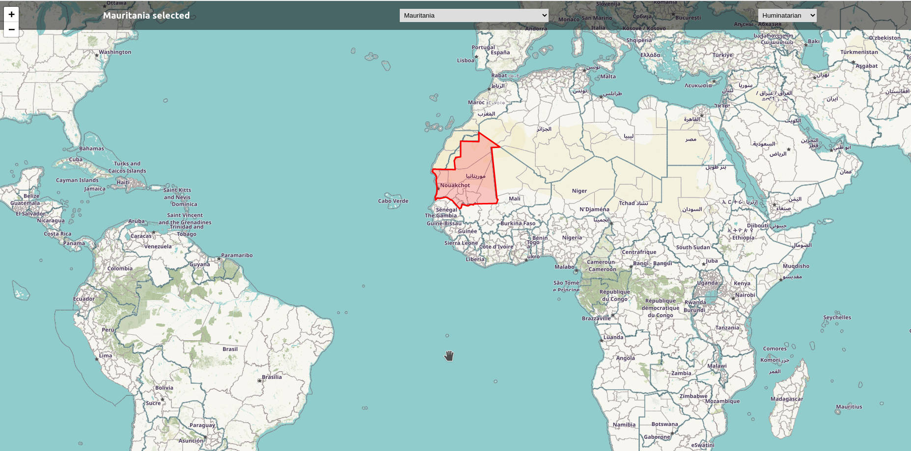
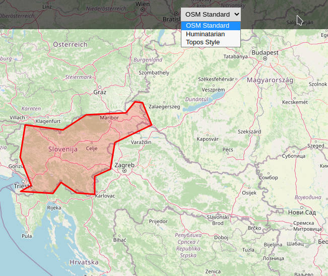
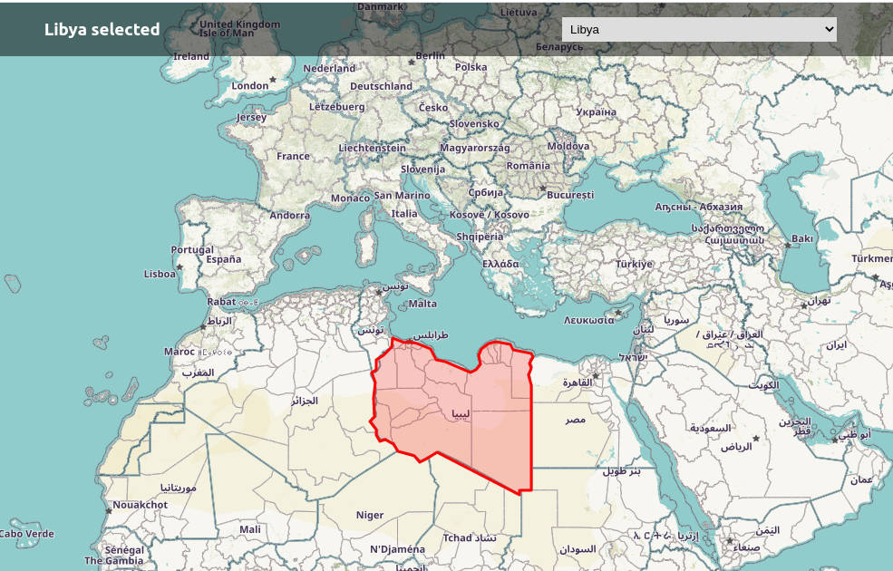

## About the project
<p align="center">

</p>

<p align="center"><i>Leaflet is a great library for implementing Open Street Maps - but gave me a hard time...</i></p> <br><br>
This small react component was mainly for my own learning purpose, but I share it here, so maybe it helps for learning some basic usage and overcoming the first obstacles with LeafletJS in React. If you are stucked ask me and check the [quick start guide of LeafletJS](https://leafletjs.com/examples/quick-start/). If you want to contribute, great!

#### Built with
* [ReactJS](http://reactjs.org)
* [LeafletJs](http://leafletjs.com)

## Getting started
Get a local copy, give it a try and implement it in your React project

#### Prerequisites
* npm
  ```sh
  npm install npm@latest -g
  ```

### Installation

1. Fork it or clone the repo directly from here
   ```sh
   git clone git@github.com:puckfried/reactLeafletComponent.git
   ```
2. Install NPM packages
   ```sh
   npm install
   ```
3. Start on your local machine
   ```sh
   npm run
   ```

## Usage

#### General
This is a ready to use map component. Clicking on the map gives you the country name and highlights the borders. The countries can be selected via dropdown,too. There are three map styles already included and selectable via dropdown:
<p align="center">
  
  <a href="https://github.com/gravitystorm/openstreetmap-carto/">    
    <p align="center">Open Street Map Standard</p>
  </a>
 <br>
 </p>
 <p align="center">
    
  <a href="https://github.com/hotosm/HDM-CartoCSS">
    <p align="center">Humanitarian Map Style</p>
  </a>
<br>
</p>
 <p align="center">
  
  <a href="https://wiki.openstreetmap.org/wiki/OpenTopoMap">
    <p align="center">Open Topo Map</p>
  </a>
</p>

#### In deep
There are 2 basic states: 
* <code>country</code>
* <code>border</code>
 
The <code>country</code> state can be used for further data fetching connected with country names. Right now the <code>country</code> state is connected with <code>border</code> state, every change triggers an useEffect hook and selects the coordinates from 2 different geo.json files a) for borders (an polygon) and b) for centering the map at the countries capital (single point). The country names are fetched, using [Nominatim](https://wiki.openstreetmap.org/wiki/Nominatim) search API. There is the possibility to fetch the coordinates for the borders too, but they were quiet detailed so speed was suffering. Right now the coordinates are mananged by low resolution geo.JSON files.
For using coordinates from geo.json files in Leaflet the arrays have to be reversed. The method <code>L.GeoJSON.coordsToLatLngs(coordinates,1)</code> is used for this. The last parameters defines the depth of the array, depending if the borders are polygones (<code>1</code>) or multi-polygones (<code>2</code>).
  
#### Known Issues
* ~~Sometimes centering is not working properly~~
* react-leaflet still in version 2.7. as there were problems with newer versions
* country names from OSM are probably not 100% similar with geo.json country names, in this rare cases centering or borders are not working, most are fixed but I never checked the whole list, feel free to click through and report

## License

Distributed under the MIT License. See `LICENSE` for more information.

## Acknowledgements

* Search API - [Nominatim-API](https://developers.google.com/youtube/v3)
* capitals geo.json data from [@Stefie](https://github.com/Stefie)
* borders geo.json data from [@johan](https://github.com/johan)
